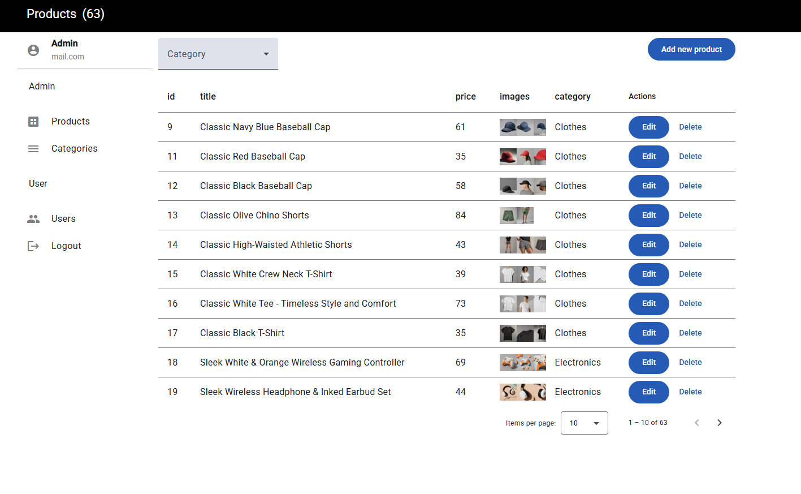

# 🛠️ E-Commerce Admin Panel (Angular 19)

**E-Commerce Admin Panel** is a modern admin dashboard built with **Angular 19**, **Apollo Angular (GraphQL)**, and **Angular Material**. It is designed to manage the e-commerce platform [**E-Commerce**](https://https://github.com/Dmytro-Doronin/e-commerce-angular) — including product creation/editing, stock control, and more.

This panel is optimized for performance using **Standalone Components**, GraphQL queries and mutations, and responsive UI with Angular Material.

---

### 🔗 Live Admin Panel

Access the live version here:  
👉 [**E-Commerce Admin Panel — Live Site**](https://e-commerce-admin-panel-xi.vercel.app)


---

## 📸 Screenshots

### 🏠 Dashboard Overview


---

## 🚀 Technologies Used

- **Angular 19** (Standalone Components)
- **Apollo Angular** – GraphQL client
- **Angular Material** – UI components
- **SCSS** – Styling
- **RxJS** – Reactive utilities
- **GraphQL** – API communication

---

## 📦 Features

- ✅ Product listing with search and filters
- ✅ Add / Edit / Delete products
- ✅ Add product images
- ✅ GraphQL queries and mutations with Apollo

---

## 🧑‍💻 Getting Started

### 1. Clone the repository

```bash
git clone https://github.com/Dmytro-Doronin/e-commerce-admin-panel.git
cd e-commerce-admin-panel

### 2. Install dependencies

npm install

### 3. GraphQL Setup

export const apolloConfig = () => {
  const httpLink = inject(HttpLink);

  return {
    link: httpLink.create({
      uri: 'https://api.escuelajs.co/graphql',
    }),
    cache: new InMemoryCache(),
  };
};

### app.config.ts

 export const appConfig: ApplicationConfig = {
  providers: [
    provideZoneChangeDetection({ eventCoalescing: true }),
    provideRouter(routes),
    provideAnimationsAsync(),
    provideHttpClient(),
    provideApollo(apolloConfig)
  ]
};

### Run the development server

ng serve
